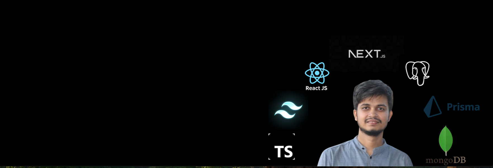

<h1 align="center">Hi 👋, I'm Md Abdul Alim</h1>
<h3 align="center">🚀 Passionate Full-Stack Developer | Lifelong Learner | Tech Enthusiast</h3>

  

---

### 💡 About Me:
- 🔥 Full-Stack Web Developer with expertise in **React, Next.js, Express, Mongoose, Prisma, PostgreSQL**
- 🎯 Always eager to learn and explore new technologies
- 💬 Ask me about **React, Next.js, Express, MongoDB, PostgreSQL**
- 📩 Reach me at: **alimsujon12@gmail.com**

---

### 🌍 Connect with Me:

  

---

### 🛠️ Languages & Tools:

  
  
  
  
  
  
  
  

### 📊 GitHub Stats:

  

  

  

### 📈 GitHub Activity Graph:

  

---

### 🧠 Fun Fact:
> 🌈 I don't just build software—I build experiences. From idea to deployment, I love crafting elegant, performant, and scalable web applications.
